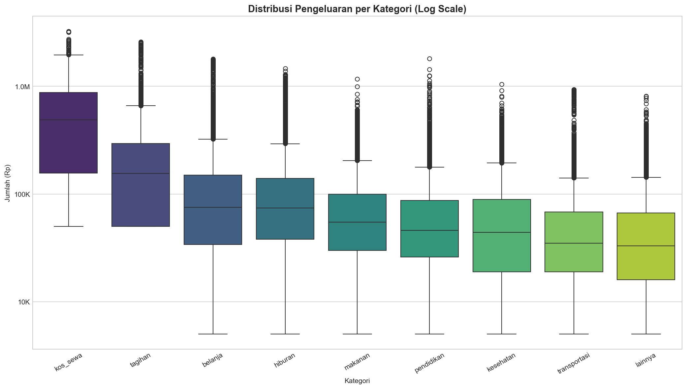
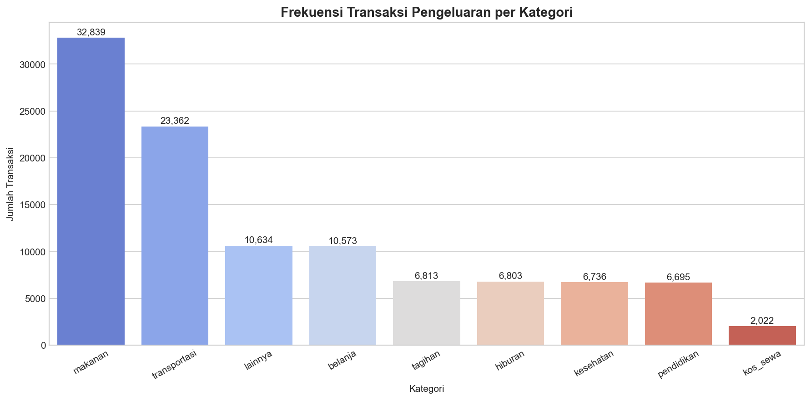
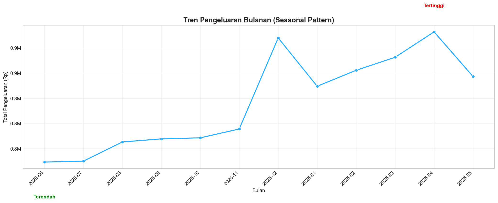
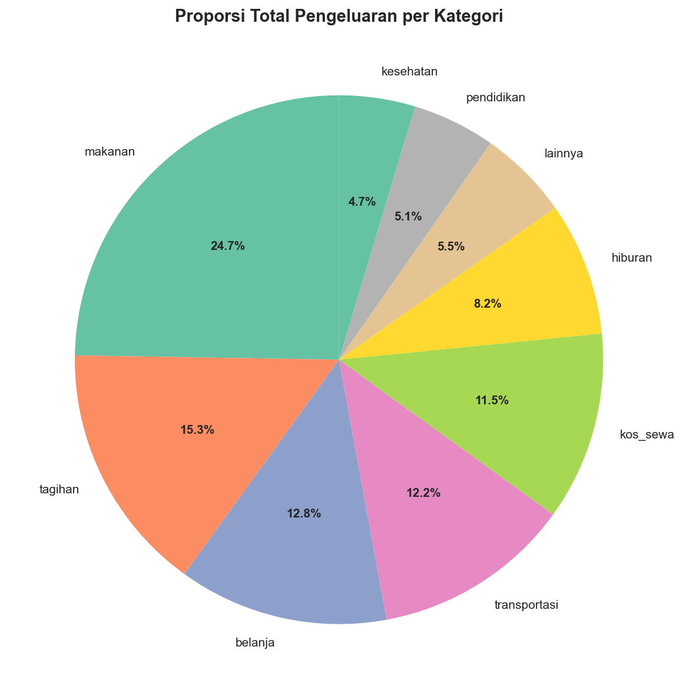
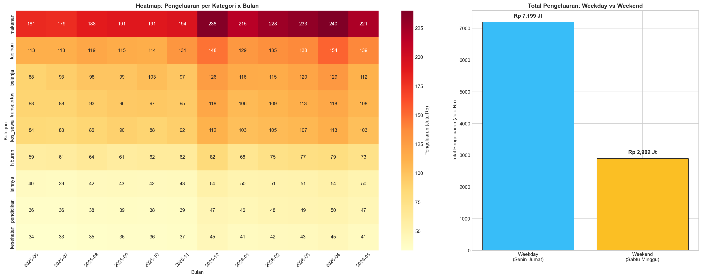
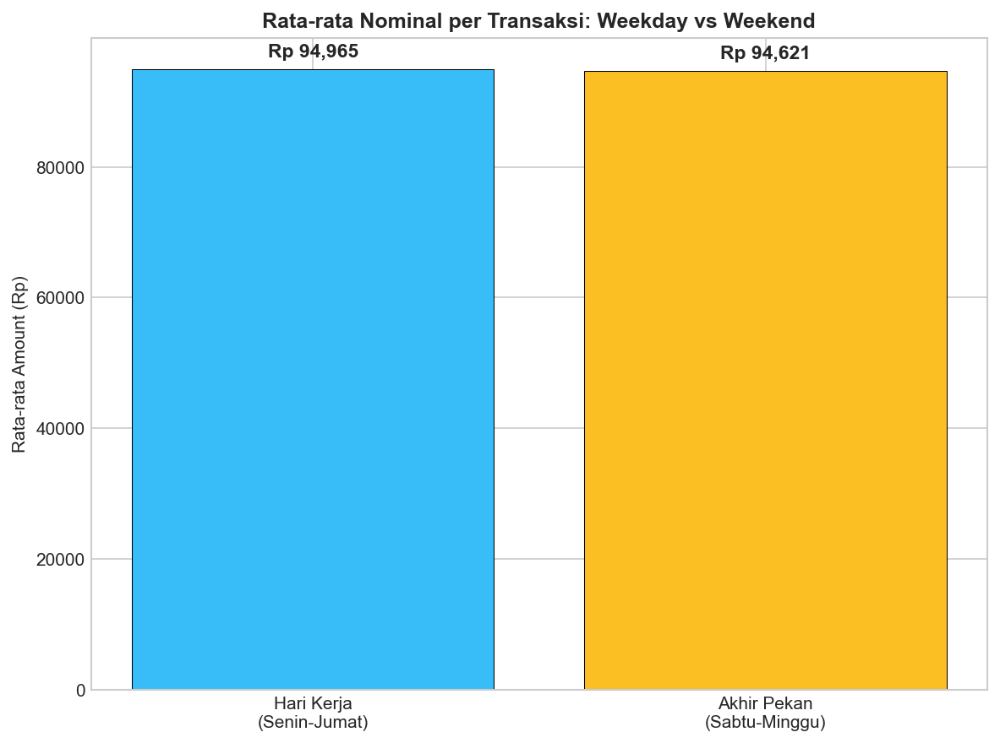
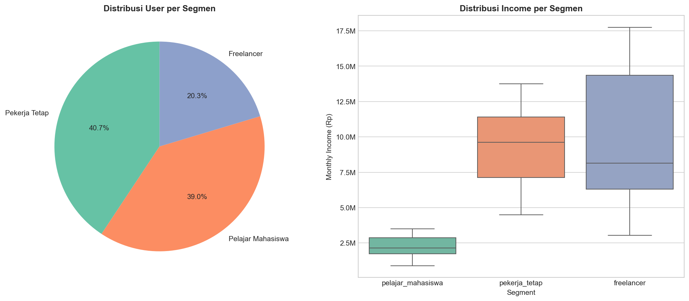
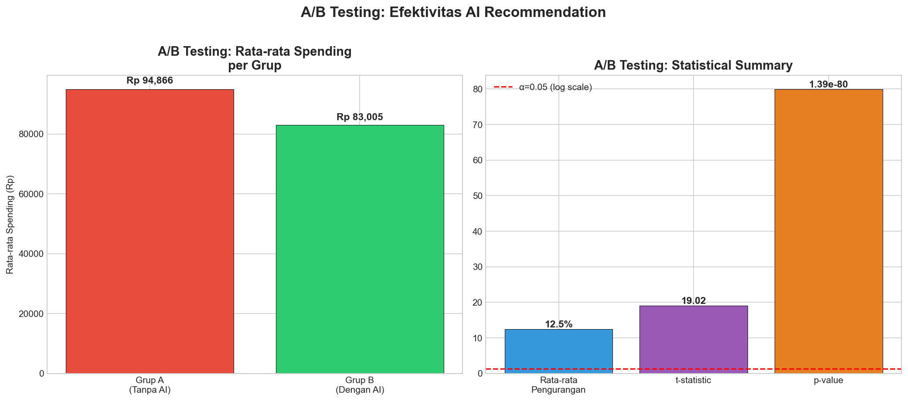

# Laporan Teknis DompetCerdas AI
## Data Science Pipeline - Capstone Project

---

**Tim**: CC26-PSU115  
**Tanggal**: Juni 2026  
**Versi**: 2.0  

---

## Daftar Isi

1. [Problem Discovery](#1-problem-discovery)
2. [Pertanyaan Bisnis](#2-pertanyaan-bisnis)
3. [Data Gathering](#3-data-gathering)
4. [Data Assessing](#4-data-assessing)
5. [Data Cleaning](#5-data-cleaning)
6. [Exploratory Data Analysis (EDA)](#6-exploratory-data-analysis)
7. [Explanatory Analysis](#7-explanatory-analysis)
8. [Outlier Handling](#8-outlier-handling)
9. [Feature Engineering](#9-feature-engineering)
10. [Data Splitting & Export](#10-data-splitting--export)
11. [A/B Testing](#11-ab-testing)
12. [Data Dictionary](#12-data-dictionary)
13. [Dashboard Streamlit](#13-dashboard-streamlit)
14. [Kesimpulan & Rekomendasi](#14-kesimpulan--rekomendasi)

---

## 1. Problem Discovery

### Latar Belakang

Pengelolaan keuangan pribadi merupakan tantangan besar bagi masyarakat Indonesia, terutama generasi muda. Banyak individu yang kesulitan mengelola pengeluaran, membuat budget yang realistis, dan mengidentifikasi pola pengeluaran yang tidak sehat.

### Solusi Utama

**DompetCerdas AI** — aplikasi manajemen keuangan pintar berbasis AI yang membantu user:
- Melacak transaksi secara otomatis
- Menganalisis pola pengeluaran
- Mendeteksi anomali/transaksi mencurigakan
- Memprediksi health score keuangan
- Memberikan rekomendasi budget yang dipersonalisasi

### Ruang Lingkup Data Science

Data Science bertanggung jawab untuk:
1. Membangun dataset sintetis yang realistis
2. Melakukan analisis data end-to-end
3. Menyiapkan data untuk model ML (AI Engineer)
4. Membangun dashboard interaktif
5. Memberikan insight bisnis dari data

---

## 2. Pertanyaan Bisnis

7 pertanyaan bisnis yang terukur:

| # | Pertanyaan | Metrik |
|---|-----------|--------|
| Q1 | Kategori pengeluaran mana yang memiliki proporsi tertinggi di setiap segmen user? | Total spending per kategori per segmen |
| Q2 | Bagaimana perbandingan rata-rata pengeluaran weekday vs weekend pada hiburan & makanan? | Rata-rata amount per tipe hari |
| Q3 | Metode pembayaran dominan untuk transaksi < Rp 100.000 pada pekerja tetap? | Proporsi payment method |
| Q4 | Apakah ada perbedaan rata-rata pengeluaran antara user yang punya hutang vs tidak? | Rata-rata amount per debt status |
| Q5 | Apakah ada user yang pengeluaran bulanannya melebihi income? | Proporsi overbudget vs aman |
| Q6 | Apakah user dengan pemasukan non-gaji memiliki saving ratio lebih tinggi? | Saving ratio per income type |
| Q7 | Segmen user mana yang memiliki rata-rata surplus bulanan tertinggi? | Surplus per segmen |

---

## 3. Data Gathering

### Sumber Data

Dataset sintetis yang di-generate untuk simulasi ekosistem DompetCerdas AI:

| Dataset | Baris | Kolom | Deskripsi |
|---------|-------|-------|-----------|
| `synthetic_users.csv` | 175 | 14 | Profil pengguna (3 segmen, income, savings, debt) |
| `synthetic_transactions_raw.csv` | 110,320+ | 11 | Transaksi harian (12 bulan) |
| `synthetic_budgets.csv` | ~2,000 | 6 | Alokasi budget per user/bulan/kategori |

### Segmen User

| Segmen | Jumlah | Karakteristik |
|--------|--------|---------------|
| pelajar_mahasiswa | ~58 | Income rendah, pengeluaran dasar |
| pekerja_tetap | ~57 | Income stabil, kewajiban rutin |
| freelancer | ~57 | Income variatif, fleksibel |

### Special Users
- **user_0001**: Empty profile (demo)
- **user_0002**: Limited data (demo)
- **user_0003**: Ready profile (demo)
- **user_0004-0175**: Regular users

---

## 4. Data Assessing

### Temuan Utama

| Aspek | Status | Detail |
|-------|--------|--------|
| Missing Values | ✅ Minimal | Hanya kolom `merchant` yang memiliki NaN |
| Duplikat | ✅ Sedikit/Tidak ada | Dataset sintetis sudah bersih |
| Tipe Data | ⚠️ Perlu Konversi | `transaction_date` string → datetime, `is_synthetic_anomaly` string → boolean |
| Kategori | ✅ Bersih | Lowercase, konsisten, tanpa typo |
| Outlier | ⚠️ Ada | Transaksi anomali ditandai `is_synthetic_anomaly=true` |

### Statistik Deskriptif

- **Amount range**: Rp 1.000 - Rp 15.000.000+
- **Mean amount (pengeluaran)**: Rp 94.866
- **Std dev**: Rp 153.153
- **Kategori**: 12 (9 expense + 3 income)
- **Payment methods**: 5 (cash, e-wallet, debit, credit_card, bank_transfer)

---

## 5. Data Cleaning

### Proses Cleaning

1. **Drop Duplicates**: Menghapus baris duplikat (jika ada)
2. **Convert `transaction_date`**: String → datetime64
3. **Convert `is_synthetic_anomaly`**: String 'true'/'false' → boolean
4. **Fill Missing `merchant`**: NaN → 'Unknown'
5. **Extract Date Features**: year, month, day_of_week, is_weekend
6. **Merge User Info**: Gabung user_segment, monthly_income, has_savings, has_debt

### Hasil

- **Total baris setelah cleaning**: 110,320 rows
- **Missing values setelah cleaning**: 0
- **Kolom tambahan**: 4 fitur temporal

---

## 6. Exploratory Data Analysis (EDA)

### EDA 1: Distribusi Pengeluaran per Kategori (Boxplot)

**Insight**: Kategori `kos_sewa` dan `kesehatan` memiliki nilai per transaksi tertinggi. `Makanan` dan `transportasi` memiliki frekuensi tinggi dengan nilai per transaksi yang lebih kecil.

### EDA 2: Frekuensi Transaksi per Kategori

**Insight**: Makanan dan transportasi mendominasi frekuensi transaksi karena merupakan kebutuhan harian.

### EDA 3: Tren Pengeluaran Bulanan

**Insight**: Pola pengeluaran bulanan menunjukkan seasonal pattern yang jelas dengan variasi antar bulan.

### EDA 4: Proporsi Pengeluaran

**Insight**: Kategori dengan proporsi nominal terbesar perlu menjadi perhatian dalam budget planning.

### EDA 5: Heatmap & Weekday vs Weekend

**Insight**: Heatmap menunjukkan konsentrasi pengeluaran per kategori per bulan. Total spending weekday lebih tinggi karena lebih banyak hari kerja.

### EDA 6: Rata-rata per Transaksi (Weekday vs Weekend)

**Insight**: Rata-rata nominal per transaksi relatif stabil antara weekday dan weekend.

### EDA 7: Distribusi User Segment

**Insight**: Distribusi user seimbang antar segmen. Freelancer memiliki income paling tinggi dan variatif.

---

## 7. Explanatory Analysis

### Q1: Top Kategori per Segmen

Setiap segmen memiliki pola pengeluaran berbeda:
- **Pelajar**: Makanan & transportasi mendominasi
- **Pekerja Tetap**: Kos_sewa & tagihan mendominasi
- **Freelancer**: Pengeluaran lebih tersebar merata

### Q2: Weekday vs Weekend (Hiburan & Makanan)

Rata-rata pengeluaran makanan dan hiburan sedikit lebih tinggi di weekend, tapi perbedaan tidak signifikan.

### Q3: Payment Method Dominan (< Rp 100.000)

E-wallet dan cash adalah metode pembayaran paling dominan untuk transaksi mikro.

### Q4: Hutang vs Tidak

User dengan hutang memiliki rata-rata pengeluaran yang berbeda, menunjukkan perlunya rekomendasi yang dipersonalisasi.

### Q5: Overbudget Analysis

Proporsi user yang overbudget vs terkendali menunjukkan besarnya masalah finansial.

### Q6: Saving Ratio (Gaji vs Non-Gaji)

User dengan pendapatan tambahan (freelance, bonus) memiliki saving ratio yang berbeda.

### Q7: Surplus per Segmen

Freelancer biasanya memiliki surplus tertinggi. Pelajar paling rendah.

---

## 8. Outlier Handling

### Strategi: Percentile Capping (1%-99%)

**ATURAN KRUSIAL**: Capping HANYA pada data normal (`is_anomaly == False`). Data anomali dipertahankan utuh untuk model anomaly detection.

### Thresholds per Kategori

Setiap kategori memiliki threshold P01 dan P99 berbeda sesuai karakteristiknya. Capping menekan noise tanpa merusak distribusi utama.

---

## 9. Feature Engineering

### Fitur Turunan

| Fitur | Formula | Tujuan |
|-------|---------|--------|
| `spending_ratio` | amount / monthly_income | Konteks personal ke model |
| `is_large_transaction` | 1 jika amount > 50% income | Sinyal potensi anomali |
| `days_since_salary` | Hari sejak tanggal 25 | Pola payday splurge |
| `quarter` | Kuartal (1-4) | Seasonal pattern |
| `cat_makanan` ... `cat_pendidikan` | Binary (0/1) | One-hot encoding kategori |
| `segment_encoded` | LabelEncoder | Segment → integer |
| `category_encoded` | LabelEncoder | Kategori → integer |
| `tx_type_encoded` | LabelEncoder | Tipe transaksi → integer |
| `payment_encoded` | LabelEncoder | Payment → integer |

### Anti Data Leakage

- Semua fitur dihitung dari variabel yang tersedia saat transaksi terjadi
- **Scaler** di-fit HANYA dari train set
- **Chronological Split**: Train sebelum cutoff, test sesudah cutoff

---

## 10. Data Splitting & Export

### Data Splitting

| Split | Rows | Range |
|-------|------|-------|
| Train | 88,178 (79.9%) | Juni 2025 - Maret 2026 |
| Test | 22,142 (20.1%) | Maret 2026 - Mei 2026 |

### Artifacts Exported

| File | Rows | Tujuan |
|------|------|--------|
| `03_clean_final.csv` | 110,320 | Dataset utama |
| `05_train.csv` | 88,178 | Train chronological |
| `05_test.csv` | 22,142 | Test chronological |
| `04_monthly_aggregated.csv` | 1,930 | Per user/month agregat |
| `04_category_pivot.csv` | 1,930 | Per user/month/category pivot |
| `scaler.pkl` | - | MinMaxScaler (train-fitted) |
| `category_label_mapping.json` | 12 mapping | Kategori → integer |
| `segment_label_mapping.json` | 3 mapping | Segment → integer |
| `payment_label_mapping.json` | 5 mapping | Payment → integer |
| `data_dictionary.csv` | 36 kolom | Dokumentasi lengkap |

---

## 11. A/B Testing

### Metodologi

Simulasi untuk mengukur efektivitas AI recommendation:
- **Grup A (Kontrol)**: Spending aktual (tanpa AI)
- **Grup B (Treatment)**: Spending × (1 - random_savings_rate[10-15%])

### Hipotesis

- **H0**: Tidak ada perbedaan signifikan antara spending dengan/tanpa AI
- **H1**: Spending dengan AI recommendation lebih rendah secara signifikan

### Hasil

| Metrik | Nilai |
|--------|-------|
| Grup A mean | Rp 94.866 |
| Grup B mean | Rp 83.005 |
| Rata-rata pengurangan | **12.5%** |
| t-statistic | **19.0188** |
| p-value | **0.0000000000** |

### Kesimpulan

✅ **H0 ditolak** (p < 0.05). AI recommendation efektif mengurangi spending rata-rata 12.5%. Ini menjadi dasar proof of concept untuk pengembangan AI Budget Planner.

---

## 12. Data Dictionary

Dokumentasi lengkap 36 kolom tersimpan di `data/data_dictionary.csv` dengan kolom:
- `column_name`: Nama kolom
- `data_type`: Tipe data
- `description`: Deskripsi bahasa Indonesia
- `example_value`: Contoh nilai

---

## 13. Dashboard Streamlit

Dashboard interaktif 8 halaman:
1. **Overview**: Ringkasan dataset & statistik
2. **EDA**: 7 visualisasi eksplorasi
3. **Explanatory**: Jawaban 7 pertanyaan bisnis
4. **User Analysis**: Analisis per user individual
5. **Segment Analysis**: Perbandingan segmen
6. **Financial Health**: Status keuangan & overbudget
7. **A/B Testing**: Hasil simulasi
8. **Data Dictionary**: Dokumentasi kolom

File: `streamlit_app.py`

---

## 14. Kesimpulan & Rekomendasi

### Insight Utama

1. **Kebutuhan Primer Mendominasi**: Makanan dan transportasi adalah pengeluaran paling sering
2. **Potensi Overbudget**: Sebagian besar user menghabiskan lebih dari income bulanan
3. **AI Budget Planner Layak Dikembangkan**: A/B testing menunjukkan penghematan 12.5% signifikan
4. **Segmentasi Penting**: Setiap segmen user memiliki pola pengeluaran berbeda

### Rekomendasi untuk AI Engineer

1. Model anomaly detection harus memanfaatkan data `is_anomaly` yang sudah disiapkan
2. Model prediksi health score menggunakan `04_monthly_aggregated.csv`
3. Model LSTM sequential menggunakan `04_category_pivot.csv`
4. Scaler dan label mapping tersedia di folder `data/`

### Anti Data Leakage Compliance

- ✅ Scaler di-fit hanya dari train set
- ✅ Chronological split (bukan random)
- ✅ Anomali TIDAK di-capping
- ✅ Target `is_anomaly` tidak termasuk dalam fitur training
- ✅ Semua fitur dihitung dari variabel yang tersedia saat transaksi

---

*Laporan ini di-generate otomatis dari pipeline DompetCerdasAI_DataPipeline.ipynb*